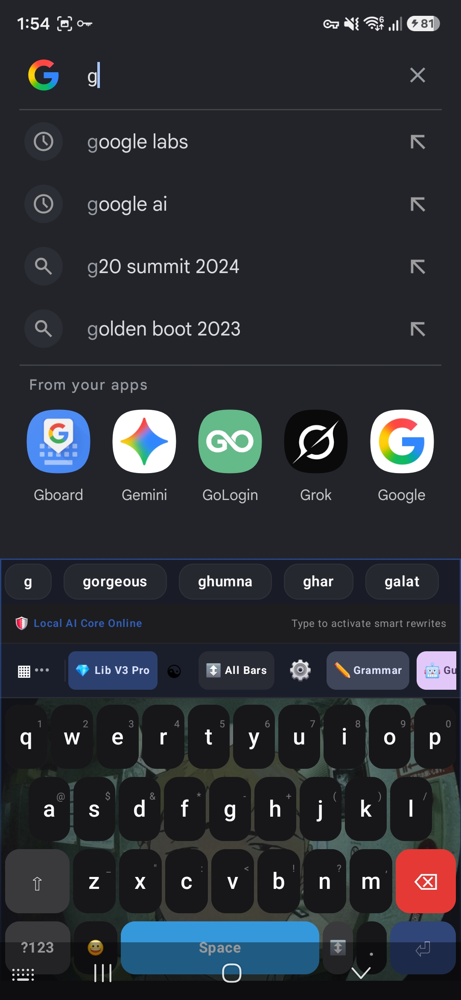
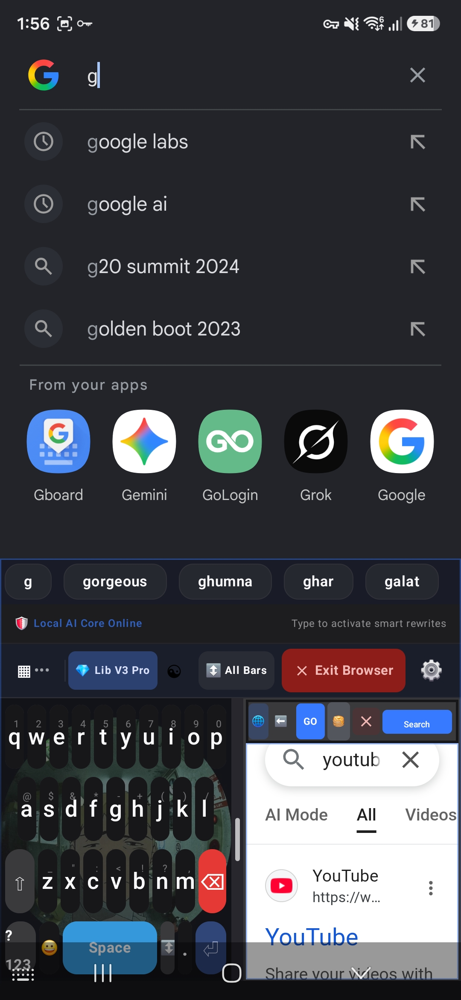

# ⌨️ AI Keyboard

An experimental Android keyboard designed to explore how **AI-assisted features, smart tools, customization, and productivity utilities** can be integrated directly into the mobile typing experience.

This project was built as part of my journey in learning **Android development and AI-assisted software development**.

---

## ✨ Features

- 🤖 **AI-Powered Writing Assistance**
  - Grammar correction
  - Smart reply suggestions
  - Context-aware writing tools

- 🧠 **AI Model Options**
  - Experimental support/interface for multiple AI model configurations
  - Designed to explore local and cloud-assisted AI workflows

- 💬 **Smart Reply & Context Assistant**
  - Quick AI-generated response suggestions
  - Context-focused productivity tools

- 🧰 **Built-in Tools & Shortcuts**
  - AI Reply
  - Text extraction
  - Translation
  - Voice tools
  - Summarization
  - Tone analysis
  - Additional experimental utilities

- 🎨 **Keyboard Customization**
  - Custom background images
  - Opacity controls
  - Keyboard appearance customization

- 📚 **Library Pro**
  - Centralized collection of AI and productivity tools
  - Quick access directly from the keyboard interface

- 🌐 **Experimental Mini Browser**
  - Access web content while using the keyboard
  - Designed to reduce context switching between apps

---

## 📱 Screenshots

### Keyboard Setup & AI Features

### AI Model Management

### Keyboard in Action

### Multi-Tasking Experience

---

## 🛠️ Tech Stack

- Android
- Kotlin
- Gradle
- AI-assisted development workflow
- Gemini API integration / experimentation
- Android Accessibility & Overlay capabilities

---

## 🎯 Project Goal

The goal of this project is to experiment with the idea of turning a traditional mobile keyboard into a **multi-functional AI productivity interface**.

Instead of switching between multiple applications for writing assistance and productivity tasks, the project explores bringing useful tools closer to the user's typing workflow.

---

## 🚧 Project Status

This project is currently an **experimental prototype**.

Some features are still under development or may require additional configuration. The project represents an ongoing learning and experimentation process rather than a production-ready application.

---

## 🤖 Development Approach

This project was developed using an **AI-assisted development workflow**.

AI tools were used to support areas such as:

- Code generation and iteration
- Debugging assistance
- UI experimentation
- Feature prototyping
- Exploring implementation approaches

I worked on defining the product idea, selecting features, testing the application, iterating on the experience, and integrating different concepts while learning through the development process.

---

## 🔮 Future Improvements

- Improve keyboard performance and stability
- Refine AI-powered writing assistance
- Improve privacy and permission handling
- Expand customization options
- Improve local AI model integration
- Optimize the user interface
- Add better documentation

---

## 👨‍💻 About the Developer

Built by **Anish Kumar**, a B.Pharm student exploring software development, Android applications, and artificial intelligence through hands-on projects.

This project is part of my journey to learn how modern AI tools can be used to turn ideas into working software.

---

⭐ If you find this project interesting, feel free to explore the repository.
